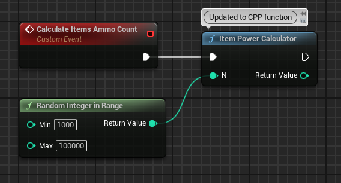
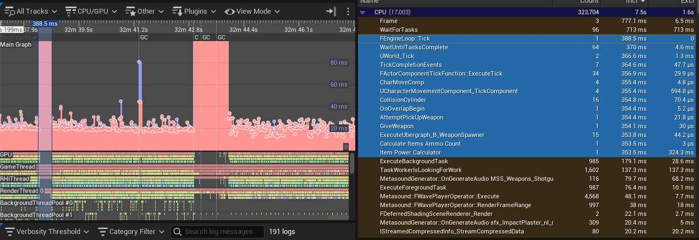
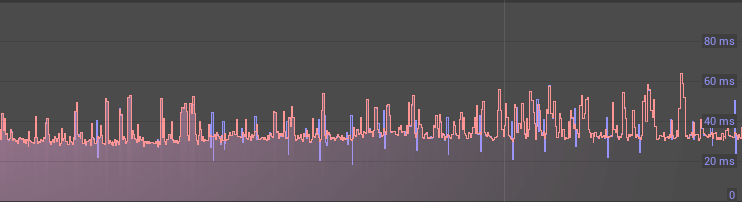

# Sportable Case Study Test
- Applicant: Josh Paddy
- Date: 14 July 2025
---

# 👋 Introduction
Thank you for the opportunity to work on this challenge. I appreciate the thought and effort that went into crafting (and strategically breaking) this project.

The brief has tasked me with achieving the following objectives:

## Main Objectives
- ✅ Find and refactor an intermittent glitch affecting player experience, from BP->CPP without functionality loss
- ✅ Build and Package for Windows
- ✅ Test the build to verify the issues(s) have been rectified

## Additional Objectives
- ✅ Create and maintain a Git repository with regular commits and comments
- ✅ Upload packaged Windows executable
- ✅ Document the development process (this document)


While the individual problems were not deeply complex, they effectively demonstrate how a developer navigates Unreal Engine internals, debugging methodology, and architectural awareness—especially within larger or more dynamic projects.

# 🔍 Project Overview & Resources
## Source
The source code can be acquired from here:
### Github Repository: [https://github.com/aura9k1/sportable-case-study](https://github.com/aura9k1/sportable-case-study)

## Build
The compiled and built version of the project is available here (archived shipping build) for **Windows x64**:
### Dropbox: [https://www.dropbox.com/scl/fi/cnm969qo6ldfdug9wt2qi/LyraGame.zip?rlkey=cbvltkf044vvl3bjfh0ykqbme&st=eef8esld&dl=0](https://www.dropbox.com/scl/fi/cnm969qo6ldfdug9wt2qi/LyraGame.zip?rlkey=cbvltkf044vvl3bjfh0ykqbme&st=eef8esld&dl=0)

## Additional Assets
⚠️ The file `Content/Effects/Textures/Flipbooks/SmokeSwirl_3_Flipbook_CHANNELPACK.uasset` is too large for Github, please download that file from here:
### Dropbox: [https://www.dropbox.com/scl/fi/xcl6mhqzl3zxzt40ohh7h/SmokeSwirl_3_Flipbook_CHANNELPACK.uasset?rlkey=xld3liokbol4e1a6b0i5aafyg&st=gnzlm56s&dl=0](https://www.dropbox.com/scl/fi/xcl6mhqzl3zxzt40ohh7h/SmokeSwirl_3_Flipbook_CHANNELPACK.uasset?rlkey=xld3liokbol4e1a6b0i5aafyg&st=gnzlm56s&dl=0)
and place it in the `Content/Effects/Textures/Flipbooks/` directory.


# 💻 Environment and Tools
## Hardware

- 2x Intel Xeon 4110 8 Core 16 Thread
- 32GB DDR4 RAM
- NVidia Quadro RTX 4000 8GB GDDR6

## Software

- Windows 11 Workstation Pro 23H2
- Unreal Engine 5.3.2
- Visual Studio 2022 Community Edition

## Other Tools

- Git
- Rider 2024.3.2


# 📓 Approach and Methodology
## Initial Diagnosis
My first steps were to familiarise myself with the project and its directory structure. This allowed me to gain a basic overview of how assets have been organised, as well as identify any potential targets for clues to resolving the problem.

## Debugging Techniques

- Examine debug logs thoroughly
- Take note of comments and tasks in code files
- Identify potential blueprint issues and poor coding principles
- Use tools like Profiling and Insights as well as command line level tools like `stat` do determine consistent performance drops

Upon reviewing crash, debug and build logs as well as look into `Saved` and `Intermediate` assets, I had ascertained some assets that I would review first:

### Assets to review (12):
| Asset | Potential Issue |
| - | - |
| ```B_AbilitySpawner.uasset``` | Suspected code quality issue |
| ```B_WeaponSpawner.uasset``` | Suspected code quality issue |
| ```LyraCharacter.h``` | Uninitialized variable(s) |
| ```SCircumferenceMarkerWidget.h``` | Uninitialized variable(s) |
| ```NS_WallPortal.NS_WallPortal``` | Variable declaration |
| ```B_SimpleHeroPawn.uasset``` | Invalid node binding(s) |
| ```BuildConfiguration.xml``` | Possible misconfiguration |
| ```LyraAnimInstance.cpp``` |  Undeclared identifier(s) |
| ```W_Credits.uasset``` | In changelog but might be ok |
| ```Character_Default.uasset``` | In changelog but might be ok |
| ```Credits/WBP_CreditList.uasset``` | In changelog but might be ok |
| ```BP_Icon.uasset``` | In changelog but might be ok |
| ```UI/WBP_CreditList.uasset``` | In changelog but might be ok |


<details>
<summary><b>Excerpts from Logs</b></summary>

<code>

- Error: Int8Property FLyraReplicatedAcceleration::AccelZ is not initialized properly. Module:LyraGame File:Character/LyraCharacter.h
- Error: FloatProperty FCircumferenceMarkerEntry::PositionAngle is not initialized properly. Module:LyraGame File:UI/Weapons/SCircumferenceMarkerWidget.h
- The tab "/Game/_Core/System/Tools/DataStoreDebugger/WBP_CustomEventAFL.WBP_CustomEventAFL_ActiveTab" attempted to spawn in layout 'LevelEditor_Layout_v1.8' but failed for some reason.
-  Ignoring very large delta of 16852162.84 seconds in calls to FAutomationControllerManager::Tick()
- LogClass: Error: FloatProperty FLyraInteractionDurationMessage::Duration is not initialized properly. Module:LyraGame File:Interaction/LyraInteractionDurationMessage.h
- Niagara graph NiagaraGraph /Game/Effects/Particles/Environmental/NS_WallPortal.NS_WallPortal:SystemDisturbed.NiagaraScriptSource_0.NiagaraGraph_0: The default value declaration for the variable 'Module.ActiveTime' is not consistent between the graph and the metadata.
- LogBlueprint: Error: [AssetLog] D:\Unreal Projects\Sportable_CaseStudy\Content\Characters\Heroes\B_SimpleHeroPawn.uasset: [Compiler] In use pin  Charatcer Name  no longer exists on node  Break CharacterDetails . Please refresh node or break links to remove pin.
- LogBlueprint: Error: [AssetLog] D:\Unreal Projects\Sportable_CaseStudy\Content\Characters\Heroes\B_SimpleHeroPawn.uasset: [Compiler] Failed to find a struct member for  Charatcer Name
- LogBlueprint: Warning: [AssetLog] D:\Unreal Projects\Sportable_CaseStudy\Content\Characters\Heroes\B_SimpleHeroPawn.uasset: [Compiler] Can't parse default value 'False' for  Details . Property: Details.
- Error: FStructProperty::Serialize Loading: Property 'StructProperty /Game/Characters/Heroes/B_SimpleHeroPawn.B_SimpleHeroPawn_C:Details'. Unknown structure.
- Failed to load 'WinPixGpuCapturer.dll' (GetLastError=126)
- D:\Unreal Projects\Sportable_CaseStudy\Source\LyraGame\Animation\LyraAnimInstance.cpp(42): error C2065: 'CurrentFrameTexture': undeclared identifier
- D:\Unreal Projects\Sportable_CaseStudy\Source\LyraGame\Animation\LyraAnimInstance.cpp(42): error C2065: 'Width': undeclared identifier
- D:\Unreal Projects\Sportable_CaseStudy\Source\LyraGame\Animation\LyraAnimInstance.cpp(42): error C2065: 'Height': undeclared identifier
- D:\Unreal Projects\Sportable_CaseStudy\Source\LyraGame\Animation\LyraAnimInstance.cpp(43): error C2065: 'CurrentFrameTexture': undeclared identifier
- D:\Unreal Projects\Sportable_CaseStudy\Source\LyraGame\Animation\LyraAnimInstance.cpp(43): error C2065: 'CurrentFrameTexture': undeclared identifier
- D:\Unreal Projects\Sportable_CaseStudy\Source\LyraGame\Animation\LyraAnimInstance.cpp(44): error C2065: 'CurrentFrameTexture': undeclared identifier
- D:\Unreal Projects\Sportable_CaseStudy\Source\LyraGame\Animation\LyraAnimInstance.cpp(45): error C2039: 'MipGenSettings': is not a member of 'UTexture2D'
- C:\Program Files\Epic Games\UE_5.3\Engine\Source\Runtime\Engine\Public\TextureResource.h(27): note: see declaration of 'UTexture2D'
- "D:/Unreal Projects/Sportable_CaseStudy/Plugins/GameFeatures/ShooterCore/Content/Blueprint/B_AbilitySpawner.uasset"
- "D:/Unreal Projects/Sportable_CaseStudy/Plugins/GameFeatures/ShooterCore/Content/Blueprint/B_WeaponSpawner.uasset"

</code>

Uncontrolled Changelist:

<code>

- "D:/Unreal Projects/Sportable_CaseStudy/Plugins/GameFeatures/ShooterCore/Content/Blueprint/B_AbilitySpawner.uasset"
- "D:/Unreal Projects/Sportable_CaseStudy/Plugins/GameFeatures/ShooterCore/Content/Blueprint/B_WeaponSpawner.uasset"
- "D:/Unreal Projects/Sportable_CaseStudy/Content/UI/Credits/W_Credits.uasset"
- "D:/Unreal Projects/Sportable_CaseStudy/Content/Characters/Character_Default.uasset"
- "D:/Unreal Projects/Sportable_CaseStudy/Content/Characters/Heroes/B_SimpleHeroPawn.uasset"
- "D:/Unreal Projects/Sportable_CaseStudy/Content/UI/Credits/WBP_CreditList.uasset"
- "D:/Unreal Projects/Sportable_CaseStudy/Content/Editor/Slate/Icons/BP_Icon.uasset"
- "D:/Unreal Projects/Sportable_CaseStudy/Content/UI/WBP_CreditList.uasset"

</code>

</details>

## Step-by-Step Recovery
### 1. Delete temporary directories
Fresh start without importing too many broken things. `Saved`, `Intermediate` and `DerivedDataCache` can all be rebuilt based on the data in `Contents` and `Source` etc.

### 2. Commit the project to git in its initial state
This way we can track all the changes we make. We can omit temporary directories to reduce repo size and improve portability.

### 3. Open the project in Visual Studio
Cleaning and rebuilding will reveal any potential issues that might prevent the project from opening in the Editor. 

### 4. Missing Code ***[Issue #1]***
Due to missing code in [`LyraActorUtilities.cpp`](Source/LyraGame/System/LyraActorUtilities.cpp), the compile failed. Fortunately the file referenced a dropbox link where the code may be obtained.

### 5. Redundant Code ***[Issue #2]***
[`LyraAnimInstance.cpp`](Source/LyraGame/Animation/LyraAnimInstance.cpp) was triggering `MipGenSettings` on `CreateTransient` 2d textures. This is redundant as these do not generate mipmaps on runtime. The code was commented out.

### 6. Invalid Variable Initializations ***[Issue #3]***
[`LyraCharacter.h`](Source/LyraGame/Character/LyraCharacter.h) and [`SCircumferenceMarkerWidget.h`](Source/LyraGame/UI/Weapons/SCircumferenceMarkerWidget.h) both have code which fails to initialize variables properly.

### 7. Remove Unused Plugin ***[Issue #4]***
The GBSNats plugin, which allows for integration with the NATS.io service,  will be removed because it is:
- only for Linux
- not being used in the project

### 8. Unperformant Blueprint Code ***[Issue #5]***
The brief created the task of identifying the hitch in gameplay as well as refactoring the blueprint code into C++.

Unreal Profiler and Insights were used in additional to play-testing with `stat` to identify and trace the problematic execution flow which was incurring a substantial performance cost on the tick time.

#### Functionality Overview

When the user overlaps a `B_WeaponsSpawner` or `B_AbilitySpawner` (child class of the former), a blueprint event `Calculate Items Ammo Count` is fired. This event generates a random integer between 1000 and 100000 and feeds it into a blueprint function called `Item Power Calculator`. 

This function is essentially a Fibonacci Number Generator, however the high input values for `n` cause an integer overflow (presumably intended), which causes an initial hitch in the gameplay.

> 🤓 In short, C++ code for this same functionality will incur less code loops vs the Blueprint Virtual Machine (BVM) by a factor of 2-3x, resulting in faster execution time.

#### Changes

The following C++ Blueprint Function Library was created:
- `ItemPowerCalculator.cpp`
- `ItemPowerCalculator.h`

The following blueprints were affected:

- `B_WeaponSpawner.uasset`
- `B_AbilitySpawner.uasset`

The following changes were applied:

- Deleted the blueprint function for `Item Power Calculator`
- Updated the blueprint event `Calculate Items Ammo Count` to call the new C++-based replacement function `ItemPowerCalculator`




#### Insights

Profiler data captured to identify the execution flow and potential source of the problem:



Play-testing as well as running Profiling and Insights tools revealed that the changes were effective:


### 9. Cook, Compile/Build and Package

#### The project was successfully cooked, compiled and built for Windows x64 platform.

# 🐞 Issues and Fixes
| # | Issue | Symptom | Diagnosis | Fix | Commit ID | Notes |
| - | - | - | - | - | - | - | 
| 1 | [`LyraActorUtilities.cpp`](Source/LyraGame/System/LyraActorUtilities.cpp) | Build failure | Missing code (code intentionally removed) | Obtain missing code from dropbox link | [`81e7012`](https://github.com/aura9k1/sportable-case-study/commit/81e7012f9b93e999961f381a325e15aa7def5e8a) | [Dropbox Link to source](https://www.dropbox.com/scl/fi/0bcqlxmcjusldiht3stzr/LyraActorUtilities.cpp?rlkey=ba1jw0rfjr0pwlpx8apfji68d&st=jhivfl97&dl=0) |
| 2 | [`LyraAnimInstance.cpp`](Source/LyraGame/Animation/LyraAnimInstance.cpp) | Compile error | Redundant code | Comment out lines 44+45 | [`31a0821`](https://github.com/aura9k1/sportable-case-study/commit/31a08214df8e8b92eeef17327f50f50432065e91) | Existing comment indicates "The Texture Can Be Removed" | 
| 3 | [`LyraCharacter.h`](Source/LyraGame/Character/LyraCharacter.h), [`SCircumferenceMarkerWidget.h`](Source/LyraGame/UI/Weapons/SCircumferenceMarkerWidget.h) | Compile error | Variables not initialized | Add initializations: <ul><li>`int8 accelZ = 0; //line 46`</li> and <li> `float PositionAngle = 0.0f; //line 26`</li></ul> | [`2213a85`](https://github.com/aura9k1/sportable-case-study/commit/2213a859815519a3e9da90517b828cc2fdc49d8f) | - | 
| 4 | **GBSNats** Plugin | Compile failure | Not supported on platform | Remove plugin | [`10dbb06`](https://github.com/aura9k1/sportable-case-study/commit/10dbb06a55a44fcfc4bcd94af24216d0985b9543) | - | 
| 5 | `Item Power Calculator` | Occassional game loop interference on pickup(overlap) | Logic likely causes integer overflow, CPP better at handling this than BP | Refactor into CPP: `Calculate Items Ammo Count` BP event now calls C++ function `Item Power Calculator` | [`3d8c559`](https://github.com/aura9k1/sportable-case-study/commit/3d8c55908390c5c1375d46382f09d11a0ba640b6) | - | 


# 📯 Results and Outcome

- C++ code was successfully integrated
    - Applied missing code
    - Fixed variable initialization issues
    - Removed redundant code
    - Converted blueprint code to C++
- Blueprints
    - Replaced blueprint function with C++ function

- Project-level
    - Removed unused plugins
    - Packaged successfully for Windows x64

# 🤓 Reflections and Recommendations

The conversion of blueprint logic to C++ significantly improved performance and clarity. However, with deeper architectural context, additional improvements could be made:

## File Organization
The Blueprint Function Library could be relocated to a more appropriate module—e.g., Calculators/ItemCalculators, better aligned with domain-specific logic.
>eg. if multiple item calculators will be created, the blueprint function library might be called `ItemCalculators` and/or placed in a `calculators` directory within the `Item Calculators` meta category.

## Full C++ Transition
The Calculate Items Ammo Count event can be migrated to C++ for full native execution.
```cpp
//header file
int32 RandomValue = UKismetMathLibrary::RandomIntegerInRange(1000, 100000);
int32 AmmoCount = UItemPowerCalculator::ItemPowerCalculator(RandomValue);

//cpp file
UFUNCTION(BlueprintCallable, Category="Weapons")
void CalculateItemsAmmoCount();
```
## Input Validation
Future-proofing the Fibonacci function with basic input checks improves code robustness and debuggability (assuming this is the desired functionality).
```cpp
int32 UItemPowerCalculator::ItemPowerCalculator(int32 n)
{
    //don't allow negative n's
    if (n < 0)
    {
        UE_LOG(LogTemp, Warning, TEXT("ItemPowerCalculator called with negative n: %d"), n);
        return 0; // or optionally: return -1;
    }

    int32 a = 0;
    int32 b = 1; //standard Fibonacci implementation 0 -> 1
    int32 c = 0;

    for (int32 i = 0; i <= n; ++i)
    {
        c = a + b;
        a = b;
        b = c;
    }

    return c;
}
```

---

**The project demonstrates my ability to diagnose, refactor, and optimize within the Unreal Engine ecosystem — combining engineering rigor with clear documentation and an iterative mindset.**
